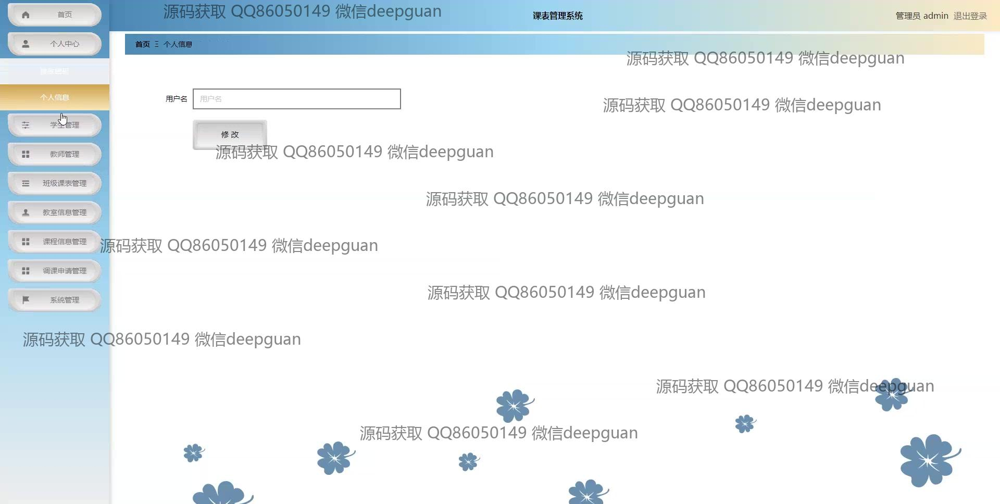
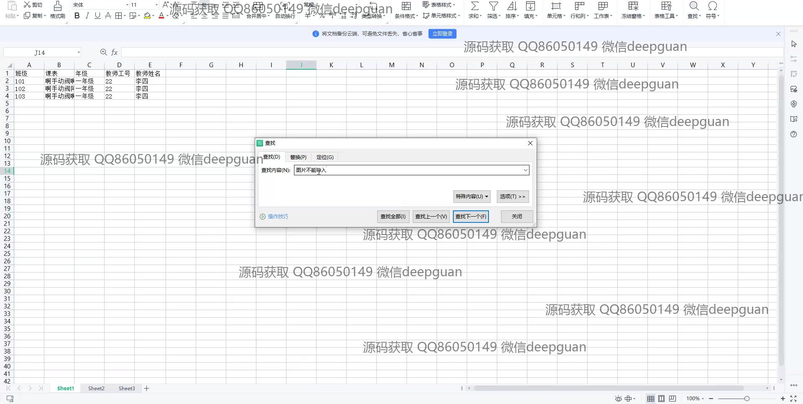
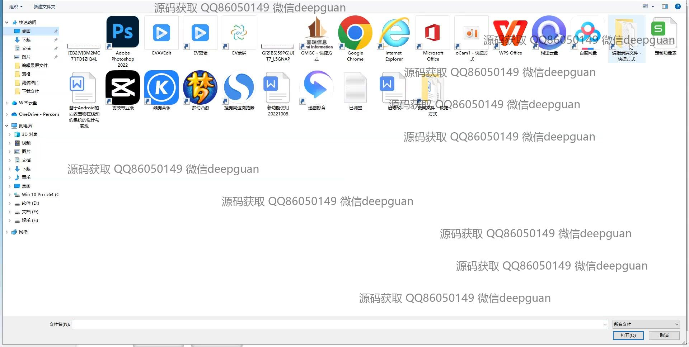

<h1 align="center">西安工商学院课表管理系统</h1>

## 简介
西安工商学院课表管理系统：角色分为学生和教师；支持用户注册、课程查询与管理、调课申请、课程评论功能，提供高效便捷的课表安排和教学资源管理。    --计算机毕业设计源码；毕设源码；java毕业设计源码

## 联系方式

<h3 align="center">获取完整代码与数据库文件 + 微信：deepguan QQ: 86050149 QQ群: 783742310</h3>

<h3 align="center">可帮忙远程部署 包运行成功！提供远程部署、修改代码、设计文档指导、代码讲解等服务！</h3>

## 功能介绍（完整见运行截图）
学生：基本功能包括注册账号并上传个人照片，查看和管理个人课表，查询课程信息，并提交调课申请。课程信息管理允许查看课程安排、教师信息和教室位置，用户可以发表评论和查看公告，具体操作如添加、查询和导出课程信息。有导航帮助定位到个人中心、班级课表等模块，提供定制化的学习体验和资源访问。  
教师：能够通过系统登录查看与管理课程安排，进行调课申请，提交和查看课表评论。教师可以查询和编辑课程信息，如课程名称、上课时间、授课地点等。管理面板提供信息反馈功能，方便教师与学生交流课程体验和建议，用户中心支持教师个人信息的管理与修改。  
管理员：管理系统用户账户和权限，包括学生和教师的注册信息。系统管理模块允许设置和调整班级、课程，以及执行信息批量导入导出操作。通过侧边栏导航到系统首页、学生管理、教师管理等功能模块，确保教学资源的合理配置与调度。管理员还负责审核课程修改申请，优化课表管理流程，提升系统运转效率。  
系统用户（学生和教师）：访问和浏览校园公告及新闻，通过系统主页进行课表和个人信息管理。支持详细查看课程排行和评论，通过教学数据分析提升教学资源使用效率。用户可方便地连接至个人中心，查看教学安排，并使用搜索功能快速定位所需信息，通过优化导航提高系统的易用性和交互体验。

## 运行截图

本代码来源于网络,仅供学习参考使用!

